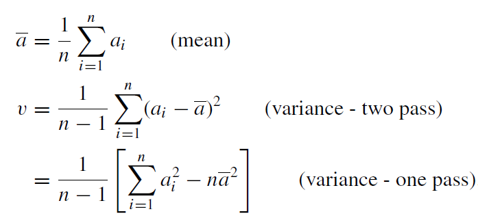

# cs601midsem_starter
This repository contains two questions mentioned below. For Question 1 you need not use the `hip` server. Question 2 requires you to use the `hip` server. When you are done answering the questions you must tag the repository as **cs601midsemsubmission** 
1) `sumdiagonal.cpp` implements incorrectly a program to compute the sum of diagonal elements of a square matrix. You may assume that the inputs provided are correct and not too large. 
Resolve all errors that include compiler, linker, and memory errors. In addition, resolve all other kinds of errors (e.g. correctness) you come accross. You may need to use GDB to debug some of the errros. Make sure that you use Valgrind to detect and fix all memory errors. When you are done resolving all the errors and have a functioanlly correct working program, insert comments to the program so that Doxygen generates a documentation corresponding to the source code. You must use the `@brief`, `@bug`, `@author`, `@file`, `@fn`, and `@param` directives in your comments. `@bug` must list all the bugs that you have fixed to make the implementation error free.

2) `q2.cpp` contains code to read input data of floating point numbers from a file `q2_input.txt`. You have to call one of the APIs specified in `q2_helper.h` to compute the mean and variance for this data set. The implementation of APIs that you need are in `q2_helper.o`. You will have to link to this object file in order to produce the executable, say, `a.out`. Typical usage of `a.out` is: `./a.out 100 q2_input.txt`. Comlpete this program by uncommenting the required line as directed in `q2.cpp`. You will uncomment the line to indicate the correct API from among the different versions provided in `q2_helper.h`. 

